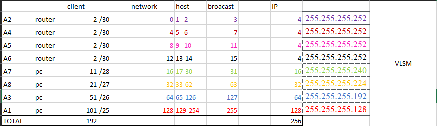

# QUIZ_JARKOM
anggota kelompok 

| Nama | NRP |
| --- | --- |
| Jovan Surya Bako | 5027201013 |
| Dzaky indra Cahya | 5027201063 |
| Gilang Bayu G.| 5027201063 |

# Studi kasus
studi kasus yang kami pakai ini adalah salah satu contoh yang ada di modul jarkom 4.
pc 1 dengan 100 client

pc 2 dengan 50 client 

pc 3 dengan 10 client

pc 4 dengan 20 client

untuk tiap router terdapat total 4 ip yang digunakan 

berikut adalah topologinya
# 1 

# 2 
Informasi subnet yang terdiri dari Netmask, Prefix, Network ID, Broadcast Address, IP Host

kami membagikan ip nya dimulai dari device yang menggunakan ip paling sedikit, yaitu router. setelah itu dilanjutkan dengan pc yang memiliki 10 client, lalu 20 client, dst

untuk informasi subnet,prefix,network,broadcast,ip host, dan total client dan IP yang bisa digunakan bisa dilihat pada gambar dibawah

# 3
Pohon pembagian IPnya seperti berikut

# 4
Implementasikan subnetting dan routing menggunakan Cisco Packet Tracer hingga antar client dapat terhubung satu sama lain (bisa melakukan ping)

agar dapat melakukan ping berbeda subnet, maka diperlukan routing pada tiap router.
yang perlu diperhatikan adalah

NETWORK: network id dari tujuan (agar bisa terhubung dengan ip   pada netmask tersebut) 

netmask: netmask dari ip tujuan 

gateway: ip yang dimasukan pada gateway berdasarkan ip port router yang akan diakses untuk mengarahkan ke ip network tujuan 

seperti contoh dibawah ini

pada router 1 harus mengenal terlebih dahulu rute yang dituju.
| Network| netmask |gateway|tujuan

| Network| netmask |gateway|tujuan
| --- | --- |---|---|
| 192.168.1.16 | 255.255.255.240 |192.168.1.2| pc 10 client/A7
| 192.168.1.4 | 255.255.255.252 |192.168.1.2| router /A4
| 192.168.1.8| 255.255.255.252 |192.168.1.2|router  /A5
| 192.168.1.12| 255.255.255.252 |192.168.1.2|router /A6
| 192.168.1.32| 255.255.255.224 |192.168.1.2|pc 21 client /A8

\
pada router 2 harus mengenal terlebih dahulu rute yang dituju.

| Network| netmask |gateway|tujuan
| --- | --- |---|---|
| 192.168.1.128 | 255.255.255.240 |192.168.1.1| pc 100 /A1
| 192.168.1.16 | 255.255.255.252 |192.168.1.6| pc 11/A7
| 192.168.1.32| 255.255.255.252 |192.168.1.6|pc 21  /A8
| 192.168.1.64| 255.255.255.192 |192.168.1.1|pc 51 /A3
| 192.168.1.8| 255.255.255.252 |192.168.1.6|router /A5
| 192.168.1.12| 255.255.255.252 |192.168.1.2|router /A6

pada router 3

pada router 4

pada router 5

jika sudah berhasil routing maka bisa langsung di ping

jika sukses maka ditampilkan pesan success

# CIDR

